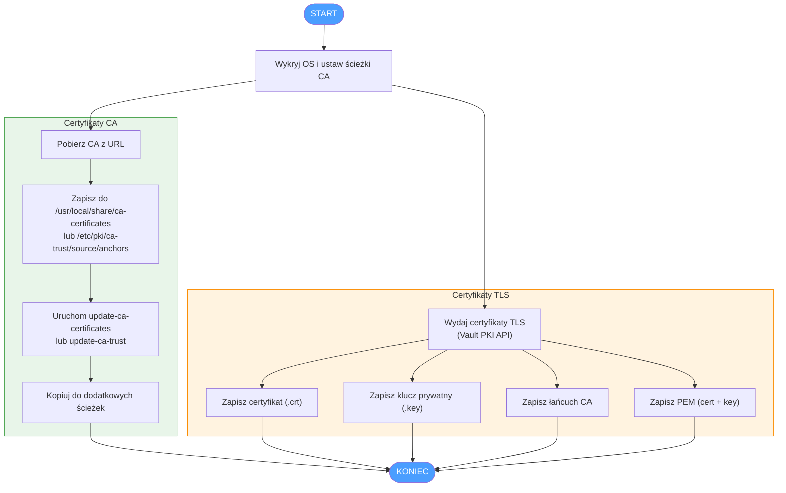

#  certificates

Rola Ansible certificates — zarządzanie certyfikatami CA i TLS (Vault PKI) w infrastrukturze rachuna-net.pl.

---
## Wymagania

- Ansible >= 2.14
- HashiCorp Vault z włączonym silnikiem PKI (dla certyfikatów TLS)
- Zmienna środowiskowa `VAULT_TOKEN` ustawiona na hoście wykonującym playbook
- Obsługiwane systemy: Debian, Ubuntu, Alpine, RHEL/CentOS 8+

---
## Zmienne roli

### Zmienne domyślne

| Zmienna | Domyślna wartość | Opis |
|---------|-----------------|------|
| `in_certificates_vault_addr` | `https://vault.rachuna-net.pl` | Adres serwera HashiCorp Vault |
| `in_certificates` | `{}` | Słownik certyfikatów CA do pobrania |
| `in_tls_certificates` | `[]` | Lista certyfikatów TLS do wydania przez Vault PKI |

### Struktura `in_certificates`

```yaml
in_certificates:
  my_ca:
    name: my-ca-cert
    url: https://example.com/ca.pem
    paths:                          # opcjonalne - dodatkowe ścieżki
      - /etc/app/ca.crt
```

### Struktura `in_tls_certificates`

```yaml
in_tls_certificates:
  - pki: pki_int                    # ścieżka silnika PKI w Vault
    role: my-role                   # nazwa roli PKI
    common_name: app.example.com    # opcjonalne, domyślnie ansible_fqdn
    ttl: "8760h"                    # opcjonalne, domyślnie 8760h (1 rok)
    alt_names:                      # opcjonalne
      - app2.example.com
    ip_sans:                        # opcjonalne
      - 10.0.0.1
    cert_file_paths:                # ścieżki zapisu certyfikatu
      - /etc/app/tls.crt
    key_file_paths:                 # ścieżki zapisu klucza prywatnego
      - /etc/app/tls.key
    pem_file_paths:                 # opcjonalne - certyfikat + klucz w jednym pliku
      - /etc/app/tls.pem
    ca_file: /etc/app/ca-chain.crt  # opcjonalne - łańcuch CA
```

## Przykład użycia

```yaml
- hosts: webservers
  roles:
    - role: pl_rachuna_net.certificates
      vars:
        in_certificates:
          internal_ca:
            name: internal-ca
            url: https://vault.example.com/v1/pki/ca/pem
        in_tls_certificates:
          - pki: pki_int
            role: webserver
            common_name: "{{ inventory_hostname }}"
            cert_file_paths:
              - /etc/nginx/ssl/cert.crt
            key_file_paths:
              - /etc/nginx/ssl/cert.key
            ca_file: /etc/nginx/ssl/ca-chain.crt
```

## Przepływ działania roli



## Co robi rola

1. **Certyfikaty CA** — pobiera certyfikaty CA z podanych URL-i i instaluje je w systemowym magazynie zaufanych certyfikatów (obsługa Debian/Ubuntu, Alpine, RHEL/CentOS)
2. **Certyfikaty TLS** — wydaje certyfikaty TLS przez Vault PKI API i zapisuje je w podanych ścieżkach
3. **Uprawnienia** — klucze prywatne i pliki PEM zapisywane z uprawnieniami `0600`, certyfikaty z `0644`

## Bezpieczeństwo

- Wszystkie zadania operujące na certyfikatach i kluczach mają włączone `no_log: true`
- Klucze prywatne zapisywane z uprawnieniami `0600`
- Katalogi kluczy prywatnych tworzone z uprawnieniami `0750`
- Token Vault pobierany ze zmiennej środowiskowej, nie z plików

---

## Contributions

Jeśli masz pomysły na ulepszenia, zgłoś problemy, rozwidl repozytorium lub utwórz Merge Request. Wszystkie wkłady są mile widziane!

[Contributions](CONTRIBUTING.md)

---

## License

Projekt licencjonowany jest na warunkach własnej licencji niekomercyjnej. Szczegóły: [LICENSE](LICENSE).

---

## Author Information

### &emsp; Maciej Rachuna

# 
